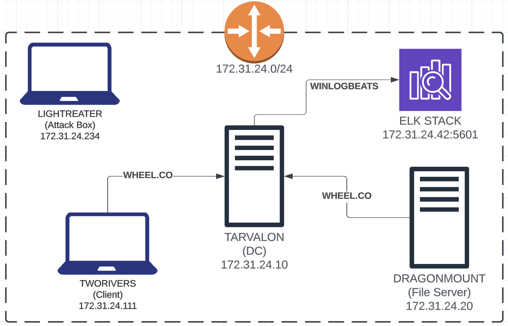

# Lab Environment Setup Instructions

The entire lab will be hosted by Pluralsight, in a safe lab environment.  If you already have an account, you can simply use your current Pluralsight account.  If you do not already have an account, you can sign up for a free, no credit card require account here:

https://www.pluralsight.com/free

> Make sure you choose the "Free account sign up"

## Start the Lab

Next, you need to browse to the lab itself, [Active Directory Sandbox](https://app.pluralsight.com/labs/detail/3942ee4b-8b01-4001-a731-c7b447e217c0/toc)

Then click **Start Lab**

Once the next page loads click **Start Environment**

It will take about 3-5 Minutes to load. 

While it is loading you can read the first challenge documentation that includes a link to a short video familiarizing yourself with the lab env.

When it is ready the button will turn green and say **open environment**. 

You are now in the lab environment where will wil conduct all of our workshops.  However!  **ALL OF THE INSTRUCTIONS ARE IN THIS GITHUB NOT IN THE CHALLENGES**

## Navigating the Lab

This lab consists of 5 different hosts within the `WHEEL` domain. You can switch between them freely by pressing ctrl+shift+alt > then clicking the top left drop down.

The devices are as follows:

| Hostname | IP | Type | Description |
| ---- | ---- | ---- | ---- |
| TWORIVERS | 172.31.24.111 | Terminal Services server | Terminal Services (a.k.a. Remote Desktop Gateway) server |
| TARVALON | 172.31.24.10 | Domain Controller | The primary domain controller (PDC) for the domain |
| DRAGONMOUNT | 172.31.24.20 | File server | File server for network share mounts and Windows-based backups |
| THESTEDDING | 172.31.24.42 | ELK server | The blue team's detection server |
| Lighteater | 172.31.24.234 | General Windows machine | Serves as the attacker's system |

### Accounts

| Type | Account | Password | Description |
| ---- | ---- | ---- | ---- |
| Local | `PSlearner` | `12qwaszx!@QWASZX` | Local admin account on each host |
| Local | `Administrator` | `Summertimeishere@2023!` | Default local admin account on TWORIVERS host |
| Domain | `wheel\mcauthon` | `Ch!ldr3nOfTheL1ght` | "Help Desk" group account |
| Domain | `wheel\svc-file` | [redacted] | SPN for DRAGONMOUNT |
| Domain | `wheel\ralthor` | `JustAn0therG!ng3r` | Domain Admin (DA) account |
| Domain | `wheel\paybara` | `IAmKetoF0rL!f3` | Enterprise Admin (EA) accoun |
| Elastic | `elastic` | `TheDestroyerOfWorlds` | Login for Elasticsearch (on THESTEDDING) |
