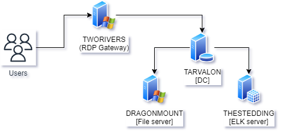

# Lab Environment Setup Instructions

The entire lab will be hosted by Pluralsight, in a safe lab environment.  If you already have an account, you can simply use your current Pluralsight account.  If you do not already have an account, you can sign up for a free, no credit card require account here:

https://www.pluralsight.com/free

> Make sure you choose the "free account sign up"

## Start the Lab

## Navigating the Lab

This lab consists of 5 different hosts within the `WHEEL` domain. You can switch between them freely by pressing ctrl+shift+alt > then clicking the top left drop down.

The devices are as follows:

| Hostname | Type | Description |
| ---- | ---- | ---- |
| TWORIVERS | Terminal Services server | Terminal Services (a.k.a. Remote Desktop Gateway) server |
| TARVALON | Domain Controller | The primary domain controller (PDC) for the domain |
| DRAGONMOUNT | File server | File server for network share mounts and Windows-based backups |
| THESTEDDING | ELK server | The blue team's detection server |
| ???? | ???? | ???? |

