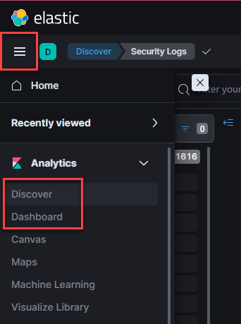
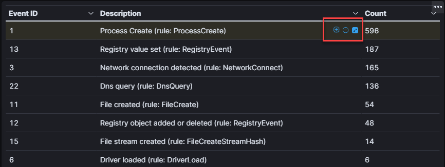

# Detecting Kerberoasting

Detecting Kerberoasting in an Active Directory environment is crucial to prevent attackers from exploiting Kerberos tickets, thereby safeguarding sensitive data and ensuring the integrity and security of enterprise networks.

For this section, we will be taking a different approach and using Elastic to filter through the data using some pre-built dashboards.

## Logging into Kibana

1. Open a browser on the client endpoint and navigate to: `http://172.31.24.42:5601`

2. Use the following credentials to log in:

> Username: `elastic`
>
> Password: `TheDestroyerOfWorlds`

3. Profit!

## Some Quick-Notes on Kibana

This will all be demonstrated live, but I'm adding it here to serve as a quick-reference.

Navigating between Kibana Apps (or views) can be done via the "hamberger" menu in the top-left.
- "Discover" will let you query all the logs
- "Dashboard" contains all the pre-built dashboards we'll be using



---

Filtering data in and out can be done my mousing over a value and clicking on the magnifying glass.



---

Ensure you are looking at the desired time range for your data! This can be changed by clicking the timeline box in the top-right.


## Analysis!

Using the same methods as the previous two sections, try filtering through the data to find the malicious activity you just performed. 

Dashboards have been pre-built for the Sysmon and Windows Security Event logs that you will need.

The only additional dataset is Windows Event ID 4769, Kerberos Service Ticket Request.

---

# Additional Notes

For the workshop, this is the end this section's instructions. Below is additional information for your enjoyment! 

Using Mimikatz, an adversary can export the cached tickets to be used in a PTT (Pass The Ticket) attack or to attempt cracking the hashes.
For example:
```powershell
.\mimikatz.exe "log log.txt" "privilege::debug" "sekurlsa::tickets /export" exit
```

When this is done, Mimikatz will store the tickets in a ".kirbi" format. The use of defensive tools or automation can be used to alert on this indicator, however this is a complicated and/or resource intestive task to accomplish at scale. 

For ad-hoc analysis, you can perform a direct query on the filesystem using the following technique:
```powershell
cmd /c where /r c:\perflogs *.kirbi 
```

Detecting a specific file system or file type across thousands of endpoints in an enterprise environment can be complex due to several reasons:
- Variety of Systems: An enterprise environment usually consists of different types of operating systems, each with their own file systems. For example, Windows uses NTFS or FAT32, Linux uses Ext4, XFS or Btrfs, and MacOS uses HFS+ or APFS. Each of these file systems has its own unique structure and metadata which adds to the complexity.
- Large Scale: Enterprises often have thousands of computers, servers, and other devices. Each of these devices can have a multitude of files, leading to billions of files to scan in total. This is a resource-intensive task in terms of both computing power and network bandwidth.
- Distributed Nature: Not all the devices are always connected to the network, and the devices can be geographically dispersed. This further complicates the process of file system detection as you would need to scan systems that are intermittently connected or are in different network segments or VPNs.
- Permission Issues: Different files and directories may have different access permissions. As a result, not all files may be accessible for scanning, especially if the scanning process does not have the necessary permissions.
- Security Considerations: In enterprise environments, there are usually strict security policies and regulations. This might limit the methods and tools you can use to scan the file systems. Additionally, any scanning activity needs to be done in a way that does not compromise the security of the system.
- Performance Impact: Scanning a file system can be a heavy operation. It needs to be done in a way that minimizes the impact on the system's performance, particularly during peak usage hours.
- File Type Identification: Identifying a specific file type is not just about looking at the file extension. It often involves reading the file headers or using other methods to determine the file type, which can be complicated and time-consuming.
- Changes Over Time: The state of a file system is not static. Files get created, modified, and deleted all the time. This dynamic nature adds another level of complexity to the detection process.

---

# Defensive Measures

Several methods can be effective as defensive measures against Kerberoasting in an Active Directory environment:

Use Strong Passwords for Service Accounts:
- Utilize long and complex passwords (25 characters or more) for service accounts. This makes it more difficult for attackers to brute force the ticket offline.


Regularly Rotate Service Account Passwords:
- Regularly changing service account passwords reduces the window of opportunity for an attacker even if they manage to retrieve a ticket.

Monitor for Suspicious Activity:
- Watch for numerous Kerberos Ticket Granting Service (TGS) requests. This might indicate a Kerberoasting attack in progress.
- Implement tools like Microsoft Advanced Threat Analytics (ATA) or similar technologies that can alert on these behaviors.

Implement Kerberos AES Encryption:
- Older RC4 encryption is more susceptible to Kerberoasting. Move to AES encryption, which is stronger and more resilient against these attacks. Ensure that service accounts support AES encryption.

Use Managed Service Accounts (MSAs):
- MSAs in Windows automatically manage password changes and use strong, complex passwords that are more resistant to brute-force attacks.

TGS Ticket Lifetime:
- Reduce the Ticket Granting Service (TGS) ticket lifetime. This minimizes the time window an attacker has to crack the ticket offline.